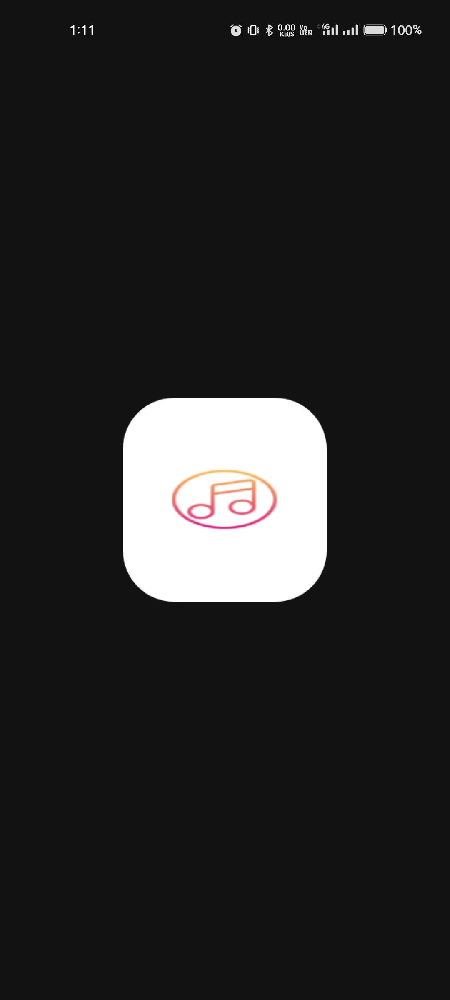

# ATLAS_MUSIC_APP

### USED_PKG

###  audioplayers: ^6.0.0
###  permission_handler: ^11.3.1
###  path_provider: ^2.1.3
###  on_audio_query: ^2.9.0
###  modal_bottom_sheet: ^3.0.0
###  flutter_screenutil: ^5.9.3
###  flutter_riverpod: ^2.5.1
###  get_it: ^7.7.0
###  text_scroll: ^0.2.0
###  flutter_native_splash: ^2.4.0
###  flutter_launcher_icons: ^0.13.1

